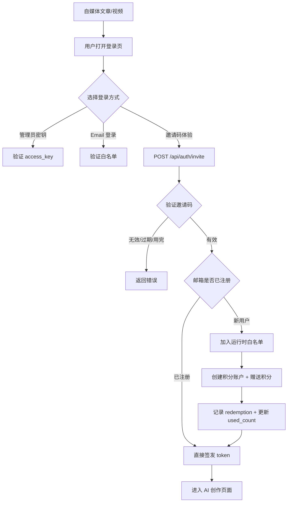

## 用户需求

通过自媒体发邀请码让用户体验系统；修复全面审查发现的所有 Bug；优化热点展示的直观性。改完即可上线。

## 产品概述

Agent Publisher 是一个 AI 驱动的微信公众号内容管理系统。本次改动涵盖三大板块：修复 9 个阻塞上线的严重 Bug、修复 9 个影响体验的问题、以及新增邀请码体验系统让自媒体推广用户零门槛进入。

## 核心功能

- P0 修复：Publishes 分页计算错误、Membership 可重复下单、Articles 变体功能无入口、Articles draftSlides 数据丢失、Login Tab 切换错误残留、AccountForm/AgentForm 错误无反馈、Trending 筛选不自动查询和 resetFilters 不一致
- P1 优化：全局 17 处空 catch 错误处理、4 处 console.log 清理、Trending 共振榜数据修正和时间格式精简、Membership 状态翻译和空状态、Articles 操作列宽度和死代码清理、Groups loading 闪烁
- P2 邀请码系统：后端 InviteCode/InviteRedemption 数据模型、POST /api/auth/invite 邀请码登录接口、Config 运行时白名单方法、管理员 CRUD API、Login.vue 新增邀请码 Tab、邀请码管理页

## 技术栈

- 前端：Vue 3 + TypeScript + TDesign Vue Next + Tiptap
- 后端：Python FastAPI + SQLAlchemy (async) + SQLite/PostgreSQL
- 构建：pnpm + Vite

## 实现方案

### Phase 1: P0 阻塞级修复

**1. Publishes.vue 分页修复**
去掉 `fetchRecords` 中行 167-169 的 total 猜测逻辑，统一用 `fetchStats` 返回的 `total`。`onReset` 中用 `await` 确保两个请求串行完成后再渲染。分页 total 仅由 `fetchStats` 设置，`fetchRecords` 不再覆盖。

**2. Membership.vue 重复下单修复**
给方案按钮添加 `:disabled="current.plan?.name === plan.name || plan.name === 'free'"`，已开通方案显示"当前方案"且不可点击。

**3. Articles.vue 变体入口 + draftSlides 修复**
在操作列模板中添加"变体"按钮调用已有的 `openVariantDialog(row)`。修复行 1902 的 `onConfirmDraft` 传递 `draftSlides` 数据给 `confirmSlideshowDraft`。

**4. Login.vue Tab 切换清错**
添加 `watch(loginMode, () => { errorMsg.value = ''; banned.value = false; })`，切换 Tab 时自动清除错误信息。

**5. AccountForm/AgentForm 错误提示**
两个表单组件的 catch 块从 `console.error(e)` 改为 `MessagePlugin.error(e?.response?.data?.detail || '操作失败')`，让用户看到后端返回的具体错误。

**6. Trending.vue 筛选自动查询**
`togglePlatformFilter`、热度 chip click、时间 chip click 末尾都自动调用 `applyFilters()`。`resetFilters` 中 `timeRange = '3d'` 与初始值一致。

### Phase 2: P1 体验优化

**7. 全局错误处理和调试清理**

- 所有空 `catch {}` 改为 `catch { console.warn(...) }` 或关键路径加 `MessagePlugin.error`
- 移除 Articles.vue 行 1316/1327/1984 和 Agents.vue 行 193 的 `console.log`

**8. Trending 共振榜和时间格式**

- 共振榜 `topClusters` 改为从 `pagination.total` 对应的全量数据计算（或在 fetchHotspots 时额外请求不带分页的 top6）
- 热点卡片的 `hotspot-extra` 区域去掉 `formatDateTime`，只保留 `formatShortTime`

**9. Membership 状态翻译和空状态**

- 状态映射：`{ active: '生效中', expired: '已过期', cancelled: '已取消', free: '未开通' }`
- plans 为空时显示 `<t-empty>` 组件

**10. Articles 操作列宽度和死代码清理**

- `width: 160` 改为 `width: 280`
- 删除未使用的 `openEditor()` 函数和对应的编辑抽屉 UI

**11. Groups loading 闪烁修复**

- `<t-loading v-if="loading" />` 改为 `<t-loading :loading="loading">` 包裹内容区

### Phase 3: P2 邀请码系统

**12. 后端数据模型**
新建 `agent_publisher/models/invite_code.py`：

- `InviteCode`：code(唯一索引), channel, max_uses, used_count, bonus_credits(默认100), expires_at, is_active, created_by, note, created_at
- `InviteRedemption`：invite_code_id(FK), user_email, ip_address, created_at

在 `models/__init__.py` 注册，在 `main.py` 的 `create_all` 中自动建表。

**13. Config 运行时白名单**
在 Settings 类添加 `_runtime_whitelist: set[str]` 和 `add_to_whitelist(email)` 方法。`is_email_allowed` 方法同时检查 env 白名单和运行时白名单。

**14. 后端邀请码 API**

- `POST /api/auth/invite`（公开）：验证邀请码有效性 → 自动加白名单 → 创建积分账户+赠送 bonus_credits → 记录 redemption → 签发 token
- `GET/POST/PUT/DELETE /api/invite-codes`（管理员）：CRUD 邀请码
- `GET /api/invite-codes/stats`（管理员）：统计数据

**15. 前端 Login.vue 邀请码 Tab**
新增第三个 Tab "邀请码体验"，包含邀请码输入框、邮箱输入框、"立即体验"按钮和引导文案。调用 `POST /api/auth/invite`。

**16. 前端邀请码管理页**
新建 `InviteCodes.vue`：表格展示所有邀请码、创建弹窗（渠道/数量/积分/过期时间）、启停操作、使用记录查看。在路由和 App.vue 管理菜单中注册。

## 实现要点

- 邀请码登录接口需设为公开（不经过 auth 中间件），添加到 FastAPI 的 `PUBLIC_PREFIXES`
- 同一 IP 24 小时内最多激活 5 个邀请码（防刷）
- 邀请码格式 `AP-{CHANNEL}-{4位随机码}`，批量生成时自动填充
- 运行时白名单不持久化到 .env，重启后通过邀请码可再次激活

## 架构设计



## 目录结构

```
agent_publisher/
  models/
    invite_code.py          # [NEW] InviteCode + InviteRedemption 模型
    __init__.py             # [MODIFY] 注册新模型
  api/
    auth.py                 # [MODIFY] 新增 POST /api/auth/invite
    invite_codes.py         # [NEW] 管理员 CRUD API
  config.py                 # [MODIFY] add_to_whitelist 方法
  main.py                   # [MODIFY] 注册新路由 + 建表

web/src/
  api/index.ts              # [MODIFY] 新增 inviteLogin, getInviteCodes 等 API
  router/index.ts           # [MODIFY] 新增 /invite-codes 路由
  views/
    Login.vue               # [MODIFY] 新增邀请码 Tab + Tab 切换清错
    InviteCodes.vue         # [NEW] 邀请码管理页
    Publishes.vue           # [MODIFY] 分页修复
    Membership.vue          # [MODIFY] 重复下单 + 状态翻译 + 空状态
    Articles.vue            # [MODIFY] 变体入口 + draftSlides + 操作列 + 死代码
    Trending.vue            # [MODIFY] 筛选自动查询 + reset + 共振榜 + 时间格式
    Groups.vue              # [MODIFY] loading 闪烁
  components/
    AccountForm.vue         # [MODIFY] 错误提示
    AgentForm.vue           # [MODIFY] 错误提示
  App.vue                   # [MODIFY] 管理菜单加邀请码入口
```

## Agent Extensions

### SubAgent

- **code-explorer**
- Purpose: 在实施每个 phase 前探索目标文件的最新完整内容，确保修改精准
- Expected outcome: 获取每个待修改文件的完整上下文，避免基于过时信息修改

### Skill

- **browse**
- Purpose: 每个 phase 完成后进行截图验证，确保功能正常
- Expected outcome: 获取页面截图确认修复效果和新功能正常渲染