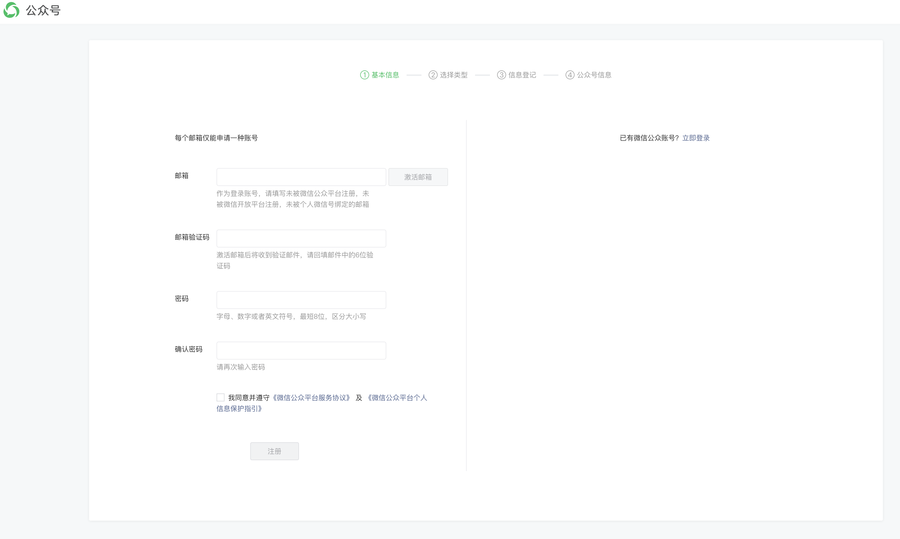
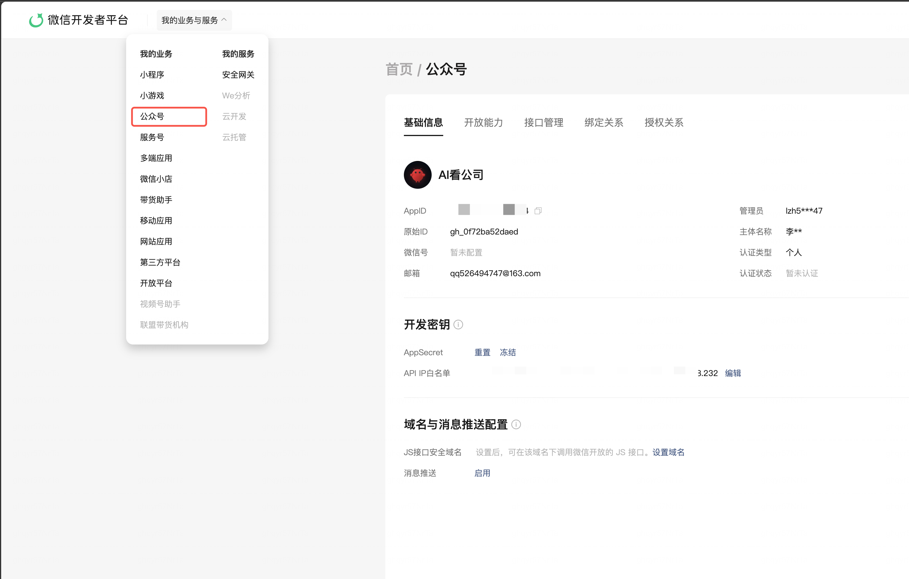
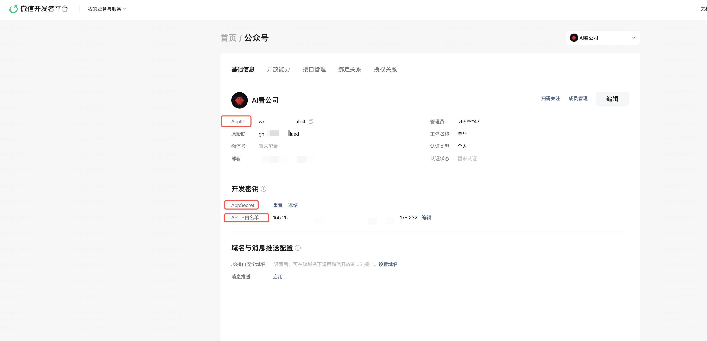

# 微信公众号快速配置指南

本指南帮助你从零开始完成微信公众号的注册和配置，让 Agent Publisher 能自动发布文章到你的公众号。

> 如果你已有公众号并已获取 AppID/AppSecret，可直接跳到 [第 4 步：配置 IP 白名单](#4-配置-ip-白名单)。

---

## 1. 注册公众号

访问微信公众平台注册页面：

🔗 [https://mp.weixin.qq.com/cgi-bin/readtemplate?t=register/step1_tmpl&lang=zh_CN](https://mp.weixin.qq.com/cgi-bin/readtemplate?t=register/step1_tmpl&lang=zh_CN)

按照页面提示，依次完成 **基本信息 → 选择类型 → 信息登记 → 公众号信息** 四个步骤：



### 订阅号 vs 服务号

| 对比项 | 订阅号 | 服务号 |
|--------|--------|--------|
| 群发频率 | 每天 1 次 | 每月 4 次 |
| 认证主体 | 个人/企业 | 仅企业/组织 |
| API 权限 | 基础接口 | 高级接口（支付等） |

**推荐**：个人开发者选择 **订阅号**，企业选择 **服务号**。

---

## 2. 登录微信开发者平台

注册完成后，登录微信开发者平台查看公众号信息：

🔗 [https://developers.weixin.qq.com/console/product/mp](https://developers.weixin.qq.com/console/product/mp)

在左侧菜单选择 **「我的业务与服务」→「公众号」**：



---

## 3. 获取 AppID 和 AppSecret

在公众号基础信息页面中，找到 **开发密钥** 区域：

1. 复制 **AppID**（应用 ID）
2. 点击 **AppSecret** 旁的「重置」获取密钥
3. 找到 **API IP白名单**，点击「编辑」准备下一步配置



> ⚠️ **重要提示**：AppSecret 仅在重置时显示一次，请立即保存！如果忘记需要再次重置。

---

## 4. 配置 IP 白名单

微信公众号 API 要求将服务器 IP 加入白名单才能调用。

**获取当前服务器公网 IP：**

```bash
# 通过 API 查询当前服务端 IP
curl http://localhost:9099/api/server-info
```

也可以在 Web 端 **「快速配置」** 引导页第 3 步直接查看。

将获取到的 IP 地址添加到上一步中看到的 **API IP白名单** 中。

> 💡 你也可以在 `.env` 中手动设置 `SERVER_IP=你的公网IP` 来指定白名单 IP。

---

## 5. 添加公众号到 Agent Publisher

### 方式一：通过 Web 界面（推荐）

登录 Agent Publisher Web 界面，进入 **「快速配置」** 页面，按向导操作即可。

### 方式二：通过 CLI 命令行

```bash
agent-pub account add \
  --name "你的公众号名称" \
  --appid "你的AppID" \
  --appsecret "你的AppSecret"
```

### 方式三：通过 Skills API（AI Agent 调用）

```bash
# 1. 认证获取 token
curl -X POST http://your-server:9099/api/skills/auth \
  -H "Content-Type: application/json" \
  -d '{"email": "your@email.com"}'

# 2. 创建公众号
curl -X POST http://your-server:9099/api/skills/accounts \
  -H "Authorization: Bearer <token>" \
  -H "Content-Type: application/json" \
  -d '{"name": "公众号名称", "appid": "你的AppID", "appsecret": "你的AppSecret"}'
```

---

## 6. 创建 Agent 并生成文章

添加公众号后，创建一个 Agent 来自动生成内容：

### CLI 方式

```bash
# 创建 Agent
agent-pub agent add \
  --name "科技前沿观察员" \
  --topic "AI与科技" \
  --account-id 1 \
  --rss "https://feeds.example.com/tech"

# 生成文章
agent-pub article generate 1

# 预览文章
agent-pub article preview 1

# 发布到草稿箱
agent-pub article publish 1
```

### Skills API 方式

```bash
# 创建 Agent
curl -X POST http://your-server:9099/api/skills/agents \
  -H "Authorization: Bearer <token>" \
  -H "Content-Type: application/json" \
  -d '{"account_id": 1, "name": "科技观察", "topic": "AI科技", "rss_sources": [{"url": "https://feeds.example.com/tech", "name": "Tech Feed"}]}'

# 触发文章生成
curl -X POST http://your-server:9099/api/skills/agents/1/generate \
  -H "Authorization: Bearer <token>"
```

---

## 常见问题

### Q: 调用微信 API 返回 IP 不在白名单？

确保已将服务器的**公网 IP** 添加到微信公众号的 API IP白名单中。可运行 `curl ifconfig.me` 查看当前 IP。

### Q: AppSecret 忘记了怎么办？

在微信开发者平台的基础信息页面，点击 AppSecret 旁的「重置」按钮重新生成。注意：重置后旧的 AppSecret 会立即失效。

### Q: 个人订阅号也能用吗？

可以。个人订阅号拥有草稿箱和群发的基础权限，Agent Publisher 的核心功能（生成文章 + 推送到草稿箱）都可以正常使用。
